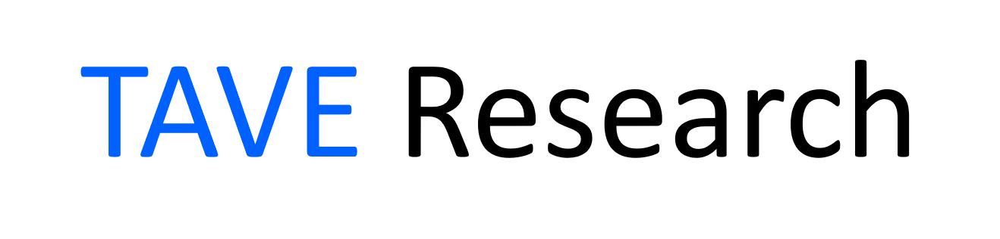

TAVE OB들을 위한 연구그룹입니다. 컴퓨터비전, 자연어처리, 그리고 데이터분석 관련 연구를 주로 하고 있습니다.

# 1. News

- [06.25.2021] 희지가 "2021 여름방학 타 대학 연구참여 프로그램"에 선발되어 7월 한달간 POSTECH 박재식 교수님(CV Lab) 밑에서 연구하게 되었습니다.

# 2. 진행중인 프로젝트

- DSTC10: Automatic Evaluation and Moderation of Open-domain Dialogue Systems (박제윤, 한지은)
- 한국어 large-scale model 연구 (박제윤, 김영현, 오예림, 이상원, 김민규)
- 인공지능 그랜드 챌린지 (이도형, 오남수, 김명찬, 박제윤)
- (추가중...🚧)

# 3. 진행중인 스터디

- Research Seminar (오창대, 원희지, 박제윤, 민지웅, 한지은)
- Deep Learning (박제윤, 이문기, 이상원, 오예림)
- Python Algorithm
- (추가중...🚧)

# 4. Notice

- [06.25.2021] 같이 연구할 분들을 찾고 있습니다! [TaveResearchOfficial@gmail.com](TaveResearchOfficial@gmail.com)로 자유롭게 연락주세요. 함께 기술로 사람들에게 즐거움을 줄 수있는 연구자, 개발자로 성장했으면 합니다.
